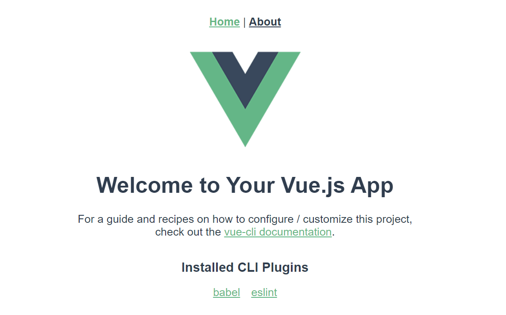

## `Vue` 配置

1. `Terminal`执行`npm i -g @vue/cli@4`

2. 在自定目录下执行`vue ui`

3. 侧栏`插件`安装顶栏

   - `router` 
   - `vuex`

   

4. 侧栏`依赖`顶栏`安装依赖`，搜索并安装

   - `jquery`3.6.1
   - `bootstrap` 5.2.0
   - `popperjs/core` 2.11.6

5. 侧栏`任务`-`serve`页面中`运行`，选中`输出`并打开网站`http://localhost:8080/#/`

   
   
   ​	若显示如下界面，则配置完成
   
   