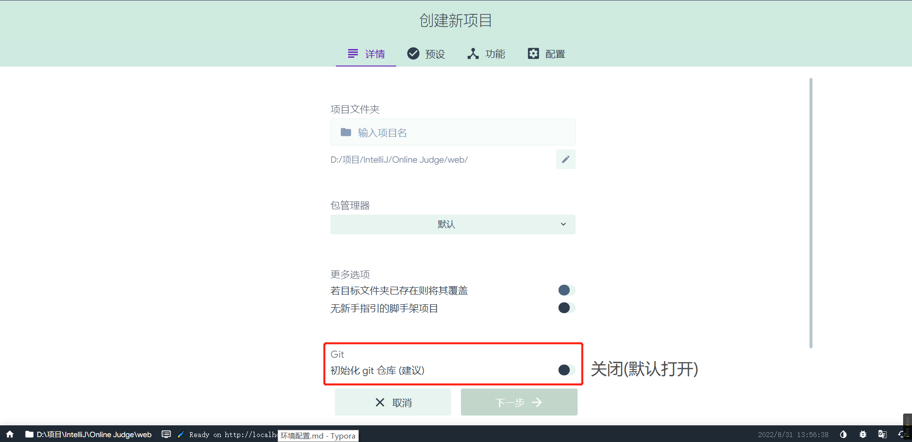
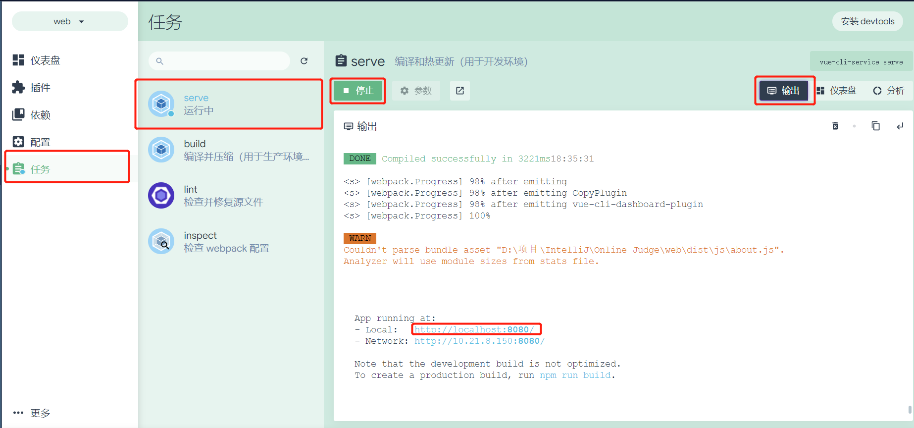

### 项目配置

#### `vue`配置

1. `Terminal`执行`npm i -g @vue/cli@4`

2. 在自定目标安装目录下执行`vue ui`

3. 在弹出[[Vue 项目管理器 ](http://localhost:8000/project/select)中点击`创建`，选择项目路径，`+在此创建新项目`，填写项目名称并`初始化Git仓库`关闭

   

4. `预设`中选择`vue2`一项，即第一项

5. 侧栏`插件`安装顶栏

   - `router` 
   - `vuex`

   

6. 侧栏`依赖`顶栏`安装依赖`，搜索并安装

   - `jquery`3.6.1
   - `bootstrap` 5.2.0
   - `popperjs/core` 2.11.6

7. 侧栏`任务`-`serve`页面中`运行`，选中`输出`并打开网站`http://localhost:8080/#/`

   

   ​	若显示如下界面，则配置完成

   

   

   #### 项目拉取